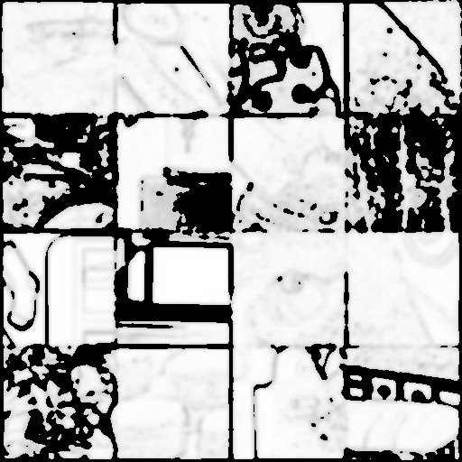

# VAE Trainer

The famous VAE of latent diffusion models, such as stable diffusion, FLUX, SORA, etc. How are they trained? This is my attempt to write distributed VAE trainer. It is largely based on [LDM's VAE](https://arxiv.org/abs/2112.10752)

<p align="center">


</p>

## Details

The VAE architecture is based on the one used in latent diffusion models, with some modifications for improved training stability and performance.

1. **Distributed Training**: Utilizes PyTorch's DistributedDataParallel (DDP) for efficient multi-GPU training.

2. **GAN Loss**: Incorporates GAN loss for enhanced image quality. A pretrained VGG16 backbone with a simple linear convolutional layer atop 16 feature maps serves as the discriminator. The hinge loss is employed for GAN loss, with a thresholding to stabilize training:

$$L_{GAN} = \max(0, D(x) - D(\hat{x}) - 0.1)$$

   where $x$ is the input and $\hat{x} = \text{Dec}(\text{Enc}(x))$ is the reconstructed image. This way, the generator (Decoder/Encoder) is only trained when the discriminator is good enough, leaving early stage training more stable.


3. **Perceptual Loss**: Utilizes LPIPS for reconstruction loss.

4. **Gradient Normalization**: Implements gradient normalization for stable training, offering a simpler alternative to rebalancing via autograd mechanism modification. This approach normalizes gradients to address potential imbalances between loss components:

$$ \nabla_{\theta} L = \frac{1}{|\nabla_{X} L_{GAN}|} \nabla_{\theta} L_{GAN} + \frac{1}{|\nabla_{X} L_{percep}|} \nabla_{\theta} L_{percep} $$

   where $\nabla_{X}$ denotes the gradient with respect to input. This method is implemented using a custom autograd function, modifying the backward pass while preserving the forward pass. You can use it as follows:

```python
class GradNormFunction(torch.autograd.Function):
    @staticmethod
    def forward(ctx, x):

        return x.clone()

    @staticmethod
    def backward(ctx, grad_output):

        grad_output_norm = torch.linalg.norm(grad_output, dim=0, keepdim=True)
    
        grad_output_normalized = grad_output / (grad_output_norm + 1e-8)

        return grad_output_normalized

def gradnorm(x):
    return GradNormFunction.apply(x)

# example:

x = gradnorm(x) # x.grad is now normalized to have unit norm.

```

5. **Constant Variance**: We implemented a fixed variance of 0.1, deviating from the conventional learnable variance in VAE architectures. This modification addresses the tendency of VAEs to indiscriminately decrease log variance, regardless of KL divergence penalty coefficients.

6. **Pooled Mean Squared Error (MSE)**: A pooled MSE was introduced to modify the original VAE reconstruction loss, reducing the model's sensitivity to high-frequency input details.

7. **Low-Pass Reconstruction Loss**: Our loss function combines LPIPS and MSE components to balance competing behaviors. While MSE and L1 losses often result in blurred outputs due to the inherent risk in predicting high-intensity signals at precise locations, retaining some MSE loss is crucial for accurate color tone calibration. To address this, we found using MSE loss on a low-pass filtered version of the image is helpful.

This method starts off by applying a Laplacian-like filter on the original grayscale image, followed by MSE loss application on the filtered result. The actual low-pass detection filter is bit more sophisticated, first detecting high frequency region, blurring, followed by truncation.

The following images illustrate an example of the filtered result:

<p align="center">


</p>

Notice how the high frequency details are colored by black: now the white region is where MSE loss is applied, making the conflict between LPIPS and MSE loss less severe.


## Files

- `ae.py`: Contains the VAE architecture implementation. Most of which is based on FLUX's VAE, with some modifications such as constant variance and multi-heads.

- `vae_trainer.py`: Main training script with DDP setup.

- `utils.py`: Utility functions and classes, including LPIPS and PatchDiscriminator.

## Usage

You need to have a dataset of png images as [webdataset](https://github.com/tmbdev/webdataset) format. You can use [img2dataset](https://github.com/rom1504/img2dataset) to download your dataset.


To start training, use the following command:

```bash
torchrun --nproc_per_node=8 vae_trainer.py
```

This will initiate training on 8 GPUs. Adjust the number based on your available hardware.

## Configuration

The trainer supports various configuration options through command-line arguments. Some key parameters include:

- `--learning_rate_vae`: Learning rate for the VAE.
- `--vae_ch`: Base channel size for the VAE.
- `--vae_ch_mult`: Channel multipliers for the VAE.
- `--do_ganloss`: Flag to enable GAN loss.

For a full list of options, refer to the `train_ddp` function in `vae_trainer.py`.

## Citation

If you find this dataset useful, please cite:

```
@misc{Training VQGAN and VAE, with detailed explanation,
  author = {Simo Ryu},
  title = {Training VQGAN and VAE, with detailed explanation},
  year = {2024},
  publisher = {GitHub},
  journal = {GitHub repository},
  howpublished = {\url{https://github.com/cloneofsimo/vqgan-training}},
}
```

---
Above readme was written by claude.
