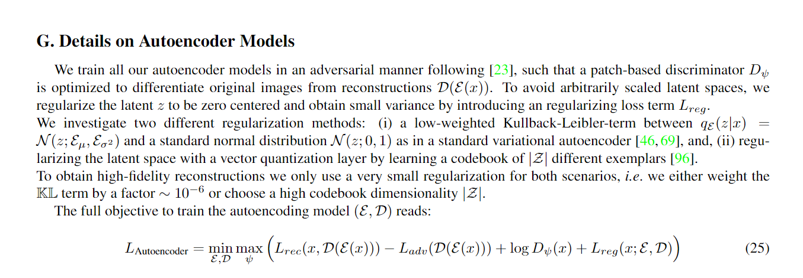

# VAE Trainer

The famous VAE of latent diffusion models, such as stable diffusion, FLUX, SORA, etc. How are they trained? This is my attempt to write distributed VAE trainer. It is largely based on [LDM's VAE](https://arxiv.org/abs/2112.10752)


## Details

This project implements a distributed VAE trainer using PyTorch's DistributedDataParallel (DDP). The VAE architecture is based on the one used in latent diffusion models, with some modifications for improved training stability and performance.

## Key Features

1. **Distributed Training**: Utilizes PyTorch's DDP for efficient multi-GPU training.
2. **GAN Loss**: Optional GAN loss for improved image quality.
3. **Perceptual Loss**: Uses LPIPS for perceptual similarity.
4. **Gradient Normalization**: This wasn't on the LDM's paper, but gradient normalization for stable training was simpler than rebalancing by hacking autograd mechanism.
5. **Log-variance clipping**: This is a modification of KL divergence loss, by clipping the log-variance to not make it too small.
6. **Pooled MSE**: This makes the mse not care about high frequency details, which is a modification of original VAE recon loss.

- `ae.py`: Contains the VAE architecture implementation.

- `vae_trainer.py`: Main training script with DDP setup.

- `utils.py`: Utility functions and classes, including LPIPS and PatchDiscriminator.

For more details, please refer to the appendix in the LDM paper.



## Usage

To start training, use the following command:

```bash
torchrun --nproc_per_node=8 vae_trainer.py
```

This will initiate training on 8 GPUs. Adjust the number based on your available hardware.

## Configuration

The trainer supports various configuration options through command-line arguments. Some key parameters include:

- `--learning_rate_vae`: Learning rate for the VAE.
- `--vae_ch`: Base channel size for the VAE.
- `--vae_ch_mult`: Channel multipliers for the VAE.
- `--do_ganloss`: Flag to enable GAN loss.

For a full list of options, refer to the `train_ddp` function in `vae_trainer.py`.

---
Above readme was written by claude.
